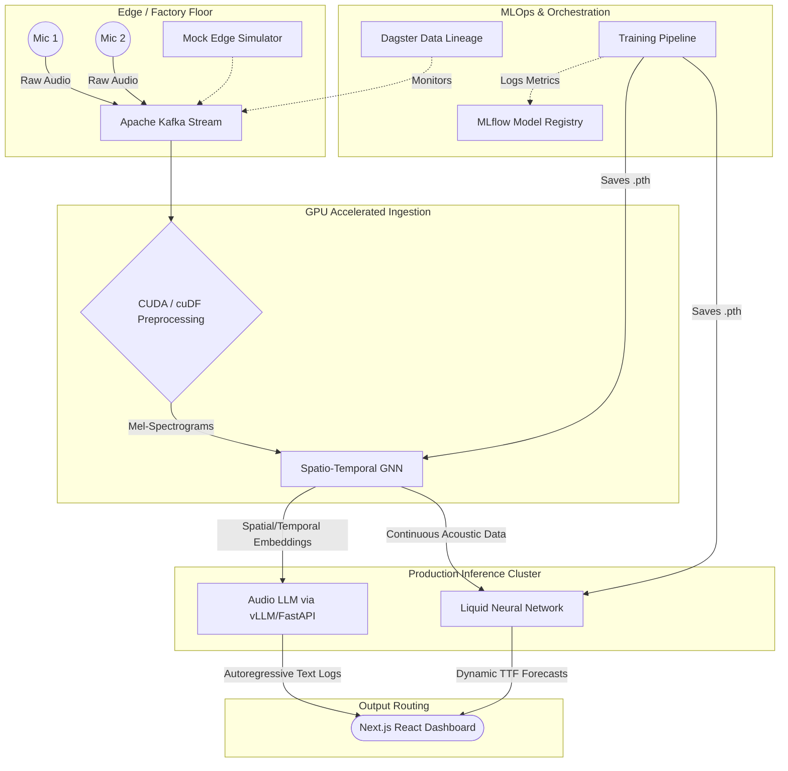

# Murmur
[](https://github.com/smparc/murmur/actions)
[]()
[]()
[]()
[]()


**Murmur** is an enterprise-grade, spatio-temporal acoustic monitoring system. It turns ambient mechanical noise into a predictive maintenance engine. By ingesting continuous, multi-channel audio feeds from a sparse grid of microphones, Murmur localizes anomalous sounds, translates them into human-readable telemetry using an Audio LLM, and dynamically forecasts cascading equipment failures using Liquid Neural Networks (LNNs). 


Designed to be shipped to production environments rather than existing as a local proof of concept, the system leverages high-performance GPU compute, containerized orchestration, continuous CI/CD, and a real-time React dashboard to handle massive audio streams in real time.


---


## System Architecture


The following diagram illustrates the continuous data flow from physical audio capture to predictive text telemetry.





---


## Technology Stack


| Component | Technology | Purpose in Production |
| :--- | :--- | :--- |
| **Data Ingestion** | Apache Kafka | Handles continuous, high-throughput raw audio streams without packet loss. |
| **Serialization** | MessagePack | Binary-encoded tensor transport — 10-50x faster than JSON for spectrogram payloads. |
| **Preprocessing** | Custom CUDA / torchaudio | Bypasses CPU bottlenecks; extracts high-dimensional mel-spectrograms directly on the GPU. |
| **Feature Extraction** | ST-GNN (PyTorch Geometric) | Models the physical facility as a topological graph with temporal attention + spatial GCN layers. |
| **Telemetry Translation**| Multimodal Audio LLM | Acts as an autoregressive decoder, streaming text logs of physical anomalies (e.g., *"Impeller cavitation detected"*). |
| **Model Serving** | FastAPI + WebSocket | Exposes the LLM via REST and real-time WebSocket for the dashboard, with health probes for K8s. |
| **Failure Prediction** | Liquid Neural Networks | Adapts to drifting degradation patterns continuously via ODEs to forecast Time-to-Failure (TTF). |
| **Anomaly Detection** | Convolutional Autoencoder + Adaptive Scorer | Unsupervised baseline learns "normal" acoustic patterns; online z-score thresholding per node. |
| **Configuration** | Centralized Settings | All settings driven by environment variables with typed defaults in `src/settings.py`. |
| **Observability** | Prometheus + MLflow | `/metrics` endpoint exports latency, throughput, anomaly counts, TTF predictions. |
| **Orchestration & Ops** | Dagster & MLflow | Tracks data lineage, pipeline health, and model drift over time. |
| **Deployment** | Docker & Kubernetes | Containerized microservices with health probes and HPA auto-scaling on acoustic energy spikes. |
| **CI/CD** | GitHub Actions | Automated linting, testing, Docker builds, and K8s deployment on push to main. |
| **Frontend** | React, Next.js, Recharts | Real-time WebSocket-connected dashboard with TTF forecasting chart and LLM diagnostic logs. |
| **Testing** | pytest | Unit tests for all models, anomaly detection, sliding window, training pipeline + integration tests. |


---


## Repository Structure


```text
murmur/
├── .github/
│   └── workflows/
│       └── ci.yml                     # CI/CD: lint, test, Docker build, K8s deploy
├── deploy/
│   ├── Dockerfile.ingest              # Container for CUDA audio preprocessing
│   ├── Dockerfile.inference           # Container for ST-GNN, LNN, and LLM serving
│   └── k8s/
│       ├── 01-kafka-cluster.yaml      # Kafka KRaft mode StatefulSet
│       ├── 02-ingest-deployment.yaml  # GPU-accelerated ingestion pods
│       ├── 03-inference-deployment.yaml # Load-balanced inference with health probes
│       └── 04-autoscaling-hpa.yaml    # Horizontal Pod Autoscaling rules
├── frontend/
│   ├── package.json                   # Next.js + TypeScript dependencies
│   └── app/
│       └── page.tsx                   # Live React dashboard (WebSocket-connected)
├── orchestration/
│   ├── __init__.py
│   └── data_pipeline.py              # Dagster assets and drift monitoring schedules
├── src/
│   ├── __init__.py
│   ├── settings.py                    # Centralized env-var-driven configuration
│   ├── detection/
│   │   ├── __init__.py
│   │   └── anomaly_detector.py        # Autoencoder + online adaptive scorer
│   ├── ingestion/
│   │   ├── __init__.py
│   │   ├── cuda_stream_processor.py   # Kafka → GPU spectrogram → sliding window → publish
│   │   ├── mock_edge_device.py        # Stochastic multi-fault factory simulator
│   │   └── stft_kernels.cu            # Custom C++ CUDA kernels (Pre-emphasis & Hann)
│   ├── mapping/
│   │   ├── __init__.py
│   │   ├── st_gnn_model.py            # Spatio-Temporal GNN (Temporal Attention + Spatial GCN)
│   │   └── topology_graph.py          # Physical room geometry configuration
│   ├── observability/
│   │   ├── __init__.py
│   │   └── metrics.py                 # Prometheus metrics (latency, anomalies, TTF)
│   ├── translation/
│   │   ├── __init__.py
│   │   └── llm_decoder.py             # FastAPI + WebSocket + Prometheus inference service
│   ├── forecasting/
│   │   ├── __init__.py
│   │   └── liquid_network.py          # Continuous-time Closed-form Network (CfC)
│   └── training/
│       └── train_pipeline.py          # Train/val/test split, degradation data, early stopping
├── tests/
│   ├── conftest.py                    # Shared pytest fixtures
│   ├── test_models.py                 # ST-GNN + topology unit tests
│   ├── test_forecasting.py            # LNN unit tests
│   ├── test_ingestion.py              # Audio generation + MessagePack tests
│   ├── test_anomaly_detection.py      # Autoencoder + scorer tests
│   ├── test_sliding_window.py         # Buffer + data quality tests
│   ├── test_training_pipeline.py      # Data gen, splitting, metrics tests
│   ├── test_api.py                    # FastAPI endpoint tests
│   ├── test_settings.py               # Configuration validation tests
│   └── test_integration.py            # Kafka roundtrip integration test
├── docker-compose.kafka.yml           # Local Kafka broker for development
├── pyproject.toml                     # Package metadata, ruff, pytest config
├── requirements.txt                   # Python dependencies (CUDA 12.x target)
├── .gitignore
└── README.md
```


---


## Execution Pipeline


The project execution is divided into distinct phases to ensure scalability and fault tolerance.


| Phase | Description | Key Deliverables |
| :--- | :--- | :--- |
| **1. Ingestion** | Raw audio is captured and piped into Kafka topics. Custom CUDA kernels process the waveform into spectrograms on the fly. | Multi-channel streaming pipeline, CUDA preprocessing module. |
| **2. Mapping** | The facility's geometry is mapped into an ST-GNN. The model learns spatial dependencies (machine distances) and temporal acoustic patterns. | Trained ST-GNN, topological acoustic embeddings. |
| **3. Translation**| The ST-GNN embeddings trigger the Audio LLM inference engine. The LLM processes the embeddings to generate human-readable diagnostics. | vLLM serving endpoint, streaming text telemetry logs. |
| **4. Forecasting**| The Liquid Neural Network ingests the continuous streams. Its internal equations adapt in real time to shifting acoustic profiles. | Dynamic TTF (Time-to-Failure) probability metrics. |
| **5. Operations**| Dagster and MLflow monitor the data streams and track the drift of the LNN predictions over time. | Validated data lineage and retrain triggers. |
| **6. Deployment** | All microservices are containerized. Kubernetes handles horizontal pod autoscaling (HPA) during loud acoustic anomaly events. | Dockerfiles, K8s deployment manifests, CI/CD, active cluster. |


---


## ⚙️ Getting Started


### Prerequisites
*   NVIDIA GPU (CUDA 12.x compatible)
*   Windows Subsystem for Linux (WSL2) with Hardware Virtualization enabled (if on Windows)
*   Docker & Docker Compose
*   Kubernetes (Minikube/Kind for local, managed K8s for production)
*   Node.js v18+


### Installation & Local Simulation


**1. Clone the repository**
```bash
git clone [https://github.com/smparc/murmur.git](https://github.com/smparc/murmur.git)
cd murmur
```


**2. Spin up the Kafka Event Stream**
```bash
docker-compose -f docker-compose.kafka.yml up -d
```


**3. Train the Models (Initialize Weights)**
```bash
python3 src/training/train_pipeline.py
```


**4. Boot the Streaming Pipeline (Requires 3 Terminals)**
```bash
# Terminal 1: Start the CUDA Preprocessor
python3 src/ingestion/cuda_stream_processor.py


# Terminal 2: Start the LLM Telemetry Server
uvicorn src.translation.llm_decoder:app --host 0.0.0.0 --port 8000


# Terminal 3: Simulate the Edge Microphones
python3 src/ingestion/mock_edge_device.py
```


**5. Launch the Live Dashboard**
```bash
cd frontend
npm install
npm run dev
```
Navigate to `http://localhost:3000` to view the telemetry.


### Production Deployment


**1. Build the Preprocessing and Inference Containers**
```bash
docker build -t murmur-ingest:latest -f deploy/Dockerfile.ingest .
docker build -t murmur-inference:latest -f deploy/Dockerfile.inference .
```


**2. Deploy to Kubernetes**
```bash
kubectl apply -f deploy/k8s/
```


**3. Verify Pod Health**
Ensure all services (Kafka brokers, ST-GNN extractors, and LLM serving engines) are running:
```bash
kubectl get pods -o wide
kubectl get hpa murmur-inference-hpa
```


---


## Environment Configuration


All settings are driven by environment variables with sensible defaults. See [`src/settings.py`](src/settings.py) for the full list.


| Variable | Default | Description |
| :--- | :--- | :--- |
| `KAFKA_BROKER` | `localhost:9092` | Kafka broker connection string |
| `LLM_MODEL_NAME` | `Qwen/Qwen1.5-1.8B` | HuggingFace model ID for telemetry generation |
| `GNN_EMBEDDING_DIM` | `256` | ST-GNN output embedding dimension |
| `MLFLOW_TRACKING_URI` | `http://localhost:5000` | MLflow tracking server URL |
| `INFERENCE_PORT` | `8000` | FastAPI server port |
| `SAMPLE_RATE` | `16000` | Audio sample rate (Hz) |


---


## Testing


```bash
# Install dev dependencies
pip install -e ".[dev]"


# Run unit tests
pytest tests/ -v --ignore=tests/test_integration.py


# Run with coverage
pytest tests/ --cov=src --cov-report=term-missing --ignore=tests/test_integration.py


# Run integration tests (requires Kafka running)
docker-compose -f docker-compose.kafka.yml up -d
pytest tests/test_integration.py -v
```


---


## Architecture Details


### ST-GNN (Spatio-Temporal Graph Neural Network)


The ST-GNN models the factory floor as a topological graph:


1. **Temporal Attention** — Multi-head self-attention over each node's spectrogram sequence to capture frequency drift and transient impulses
2. **Spatial GCN** — Graph convolutional layers propagate acoustic correlations across physically connected microphone nodes (inverse-distance weighted edges)
3. **Graph Readout** — Global mean pooling + MLP projects the entire graph state into a dense embedding for downstream LLM/LNN consumption


### WebSocket Real-Time Feed


The dashboard connects to `ws://localhost:8000/ws/telemetry` via WebSocket. Every time the LLM generates a diagnostic, it's automatically broadcast to all connected clients with structured anomaly data (severity, TTF prediction, anomaly score) — not derived from text regex. The frontend includes auto-reconnect with exponential backoff. When disconnected, a clear "Backend offline" message is shown instead of fake data, which is critical for safety-critical monitoring systems.
