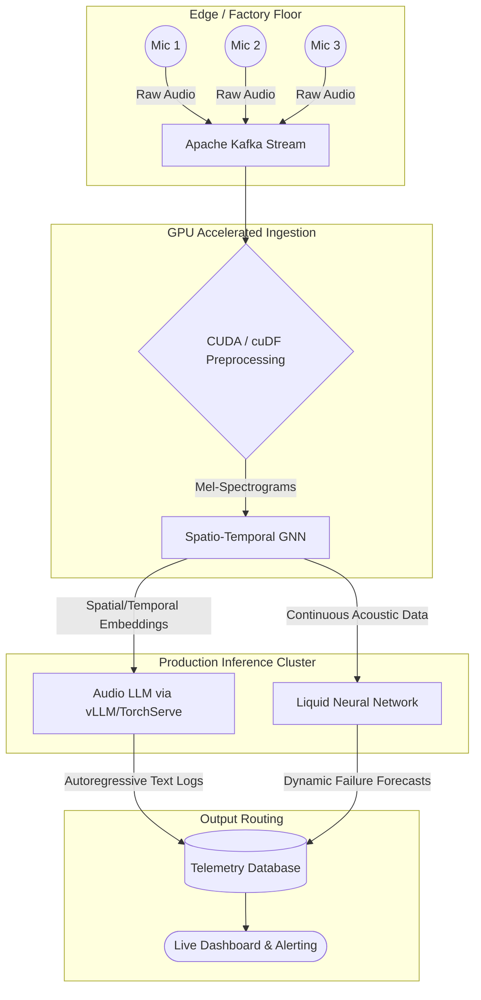

# Murmur
[]()
[]()
[]()

**Murmur** is an enterprise-grade, spatio-temporal acoustic monitoring system. It turns ambient mechanical noise into a predictive maintenance engine. By ingesting continuous, multi-channel audio feeds from a sparse grid of microphones, Murmur localizes anomalous sounds, translates them into human-readable telemetry using an Audio LLM, and dynamically forecasts cascading equipment failures using Liquid Neural Networks (LNNs). 

Designed to be shipped to production environments rather than existing as a local proof of concept, the system leverages high-performance GPU compute and containerized orchestration to handle massive audio streams in real time.

---

## System Architecture

The following diagram illustrates the continuous data flow from physical audio capture to predictive text telemetry.



---

## Technology Stack

| Component | Technology | Purpose in Production |
| :--- | :--- | :--- |
| **Data Ingestion** | Apache Kafka | Handles continuous, high-throughput raw audio streams without packet loss. |
| **Preprocessing** | Custom CUDA / RAPIDS | Bypasses CPU bottlenecks; extracts high-dimensional mel-spectrograms directly on the GPU. |
| **Feature Extraction** | ST-GNN | Models the physical facility as a topological graph to localize sound sources and track temporal frequency shifts. |
| **Telemetry Translation**| Multimodal Audio LLM | Acts as an autoregressive decoder, streaming text logs of physical anomalies (e.g., *"Impeller cavitation detected"*). |
| **Model Serving** | vLLM / TorchServe | Exposes the LLM via FastAPI, utilizing continuous batching to minimize Time-to-First-Token (TTFT). |
| **Failure Prediction** | Liquid Neural Networks | Adapts to drifting degradation patterns continuously via ODEs to forecast Time-to-Failure (TTF). |
| **Orchestration** | Docker & Kubernetes | Containerizes microservices and auto-scales inference pods dynamically based on acoustic energy spikes. |

---

## Execution Pipeline

The project execution is divided into five distinct phases to ensure scalability and fault tolerance.

| Phase | Description | Key Deliverables |
| :--- | :--- | :--- |
| **1. Ingestion** | Raw audio is captured and piped into Kafka topics. Custom CUDA kernels process the waveform into spectrograms on the fly. | Multi-channel streaming pipeline, CUDA preprocessing module. |
| **2. Mapping** | The facility's geometry is mapped into an ST-GNN. The model learns spatial dependencies (machine distances) and temporal acoustic patterns. | Trained ST-GNN, topological acoustic embeddings. |
| **3. Translation**| The ST-GNN embeddings trigger the Audio LLM inference engine. The LLM processes the embeddings to generate human-readable diagnostics. | vLLM serving endpoint, streaming text telemetry logs. |
| **4. Forecasting**| The Liquid Neural Network ingests the continuous streams. Its internal equations adapt in real time to shifting acoustic profiles. | Dynamic TTF (Time-to-Failure) probability metrics. |
| **5. Deployment** | All microservices are containerized. Kubernetes handles horizontal pod autoscaling (HPA) during loud acoustic anomaly events. | Dockerfiles, K8s deployment manifests, active cluster. |

---

## ⚙️ Getting Started

### Prerequisites
*   NVIDIA GPU (CUDA 11.8+ compatible)
*   Docker & Docker Compose
*   Kubernetes (Minikube for local dev, or managed K8s for production)
*   Apache Kafka

### Installation

**1. Clone the repository**
```bash
git clone [https://github.com/smparc/murmur.git](https://github.com/smparc/murmur.git)
cd murmur
```

**2. Spin up the Kafka Event Stream**
```bash
docker-compose -f docker-compose.kafka.yml up -d
```

**3. Build the CUDA Preprocessing and Inference Containers**
```bash
docker build -t murmur-ingest:latest -f deploy/Dockerfile.ingest .
docker build -t murmur-inference:latest -f deploy/Dockerfile.inference .
```

**4. Deploy to Kubernetes**
```bash
kubectl apply -f deploy/k8s/
```

**5. Verify Pod Health**
Ensure all services (Kafka brokers, ST-GNN extractors, and vLLM serving engines) are running:
```bash
kubectl get pods -n murmur-production
```
