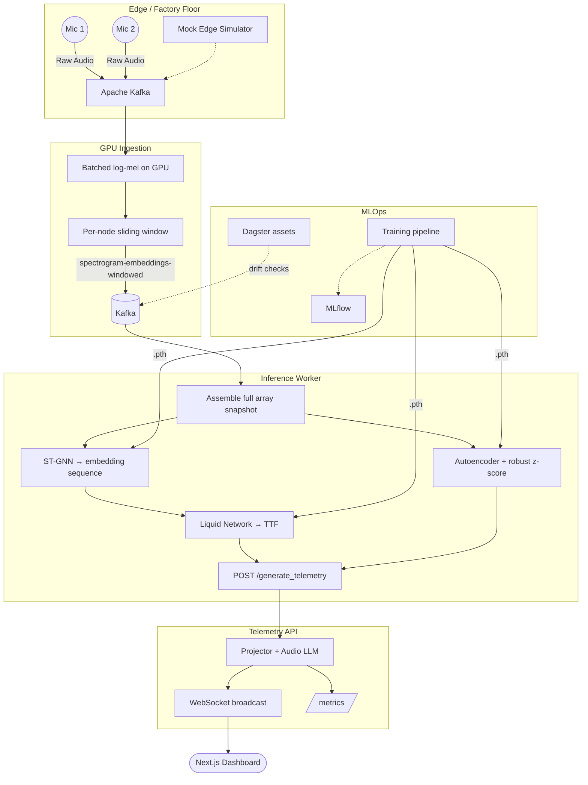

# Murmur

[](https://github.com/smparc/murmur/actions/workflows/ci.yml)
[]()
[](LICENSE)
[]()
[]()

**Murmur** is a spatio-temporal acoustic monitoring system. It turns ambient
mechanical noise into a predictive maintenance signal: continuous multi-channel
audio from a sparse microphone grid is localised across a graph of the facility,
scored for anomalies against each sensor's own baseline, projected forward into
a Time-to-Failure estimate by a continuous-time network, and rendered as
human-readable telemetry on a live dashboard.

---

## System Architecture


```mermaid
graph TD
    subgraph Edge["Edge / Factory Floor"]
        M1((Mic 1)) -->|Raw Audio| K[Apache Kafka]
        M2((Mic 2)) -->|Raw Audio| K
        Sim[Mock Edge Simulator] -.-> K
    end

    subgraph Ingest["GPU Ingestion"]
        K --> C[Batched log-mel on GPU]
        C --> W[Per-node sliding window]
        W -->|spectrogram-embeddings-windowed| KT[(Kafka)]
    end

    subgraph Worker["Inference Worker"]
        KT --> A[Assemble full array snapshot]
        A --> ST[ST-GNN → embedding sequence]
        ST --> LNN[Liquid Network → TTF]
        A --> AD[Autoencoder + robust z-score]
        LNN --> POST[POST /generate_telemetry]
        AD --> POST
    end

    subgraph Serve["Telemetry API"]
        POST --> LLM[Projector + Audio LLM]
        LLM --> WS[WebSocket broadcast]
        LLM --> PM[/metrics/]
    end

    WS --> UI([Next.js Dashboard])

    subgraph Ops["MLOps"]
        Dagster[Dagster assets] -.->|drift checks| KT
        Train[Training pipeline] -->|.pth| ST
        Train -->|.pth| LNN
        Train -->|.pth| AD
        Train -.-> MLflow[MLflow]
    end
```

The **inference worker** is the piece that makes this a system rather than a
collection of services: it consumes spectrogram windows, assembles a coherent
snapshot across the whole microphone array, runs the model chain, and submits
scored telemetry to the API.

---

## Technology Stack

| Component | Technology | Purpose in Production |
| :--- | :--- | :--- |
| **Data Ingestion** | Apache Kafka | High-throughput audio transport with at-least-once delivery and manual offset commits. |
| **Serialization** | MessagePack | Binary tensor transport, far cheaper than JSON for spectrogram payloads. |
| **Preprocessing** | torchaudio on CUDA | Batched log-mel spectrograms; chunks are fused into one GPU call rather than processed individually. |
| **Feature Extraction** | ST-GNN (PyTorch Geometric) | Temporal self-attention with positional encoding, then spatial GCN over a distance-weighted graph. |
| **Anomaly Detection** | Conv autoencoder + robust scorer | Unsupervised baseline; per-node median/MAD z-scoring adapts to sensor-specific noise floors. |
| **Failure Prediction** | Liquid Neural Network (CfC) | Continuous-time forecasting over genuinely irregular inter-frame intervals. |
| **Telemetry Translation** | Multimodal Audio LLM | Autoregressive diagnostics from a trained projection adapter; degrades to templated text when no LLM is resident. |
| **Model Serving** | FastAPI + WebSocket | REST, live WebSocket feed, API-key auth, rate limiting, split liveness/readiness probes. |
| **Configuration** | Validated settings | Environment-driven and validated at import, including the microphone layout. |
| **Observability** | Prometheus + MLflow | Latency, throughput, anomaly counts, TTF, consumer lag, end-to-end frame age. |
| **Orchestration** | Dagster | Topology validation, detector health, drift evaluation against a baseline. |
| **Deployment** | Docker & Kubernetes | Non-root images, resource limits, PDB, GPU-aware and lag-driven autoscaling. |
| **CI/CD** | GitHub Actions | Lint, format, tests on 3 Python versions, Kafka integration, frontend build, manifest validation, image publish. |
| **Frontend** | React, Next.js, Recharts | Per-node forecast series, exponential-backoff reconnect, staleness indicators. |
| **Testing** | pytest | 123 tests across models, detection, ingestion, worker, API, auth and configuration. |

---

## Repository Structure

```text
murmur/
├── .github/workflows/ci.yml           # Lint, test, integration, frontend, images, manifests
├── deploy/
│   ├── Dockerfile.ingest              # CUDA ingestion image
│   ├── Dockerfile.inference           # API + worker image
│   └── k8s/                           # Namespace, Kafka, deployments, HPAs, PDB
├── frontend/                          # Next.js dashboard (App Router + Tailwind)
├── orchestration/data_pipeline.py     # Dagster assets and drift schedule
├── src/
│   ├── settings.py                    # Validated env-driven configuration
│   ├── detection/anomaly_detector.py  # Autoencoder + online robust scorer
│   ├── forecasting/liquid_network.py  # Closed-form Continuous-time network
│   ├── inference/worker.py            # Windows → models → telemetry
│   ├── ingestion/
│   │   ├── cuda_stream_processor.py   # Kafka → batched GPU log-mel → windows
│   │   ├── mock_edge_device.py        # Multi-fault factory simulator
│   │   └── stft_kernels.cu            # Reference CUDA kernels (not on the hot path)
│   ├── mapping/
│   │   ├── st_gnn_model.py            # Temporal attention + spatial GCN
│   │   └── topology_graph.py          # Distance-weighted acoustic graph
│   ├── observability/metrics.py       # Prometheus metrics
│   ├── training/train_pipeline.py     # Three-stage training
│   └── translation/llm_decoder.py     # FastAPI + WebSocket telemetry service
└── tests/                             # 123 unit + integration tests
```

---

## Getting Started

### Prerequisites

- Python 3.10–3.12
- Docker & Docker Compose
- Node.js 18+ (dashboard)
- NVIDIA GPU with CUDA 12.x — optional; everything runs on CPU

### Installation

```bash
git clone https://github.com/smparc/murmur.git
cd murmur

python -m venv .venv && source .venv/bin/activate   # Windows: .venv\Scripts\activate

# CPU wheels; omit for the default CUDA build
pip install --index-url https://download.pytorch.org/whl/cpu torch torchaudio
pip install -e ".[dev]"
```

### Running the pipeline

```bash
# 1. Broker
docker compose -f docker-compose.kafka.yml up -d

# 2. Train (writes models/*.pth)
murmur-train

# 3. Four processes
murmur-simulate    # edge microphones      → raw-audio-stream
murmur-ingest      # GPU preprocessing     → spectrogram-embeddings-windowed
murmur-worker      # models + scoring      → POST /generate_telemetry
uvicorn src.translation.llm_decoder:app --host 0.0.0.0 --port 8000

# 4. Dashboard
cd frontend && npm install && npm run dev
```

Then open <http://localhost:3000>.

To skip the multi-gigabyte model download during development, set
`LLM_ENABLED=false`. The service still emits full structured telemetry — anomaly
score, severity, TTF — with the narrative field templated. Responses carry a
`generated` flag so the dashboard can label templated text as such.

### Production deployment

```bash
docker build -t murmur-ingest:latest -f deploy/Dockerfile.ingest .
docker build -t murmur-inference:latest -f deploy/Dockerfile.inference .

# Set a real API key first — an empty key disables authentication
kubectl apply -f deploy/k8s/
kubectl get pods -n murmur -o wide
```

---

## Configuration

All settings are environment variables, validated at import. See
[`src/settings.py`](src/settings.py).

| Variable | Default | Description |
| :--- | :--- | :--- |
| `KAFKA_BROKER` | `localhost:9092` | Broker connection string |
| `MIC_COORDS` | 4-mic default | Microphone layout as JSON `[[x,y,z], ...]`, in metres |
| `DISTANCE_THRESHOLD` | `15.0` | Maximum acoustic coupling distance (m) |
| `SAMPLE_RATE` / `N_FFT` / `HOP_LENGTH` / `N_MELS` | `16000` / `1024` / `512` / `64` | STFT parameters |
| `SEQ_LENGTH` | `50` | Frames per temporal window |
| `GNN_EMBEDDING_DIM` | `256` | ST-GNN output dimension |
| `ANOMALY_Z_THRESHOLD` | `3.0` | Robust-z above which a frame is flagged |
| `LLM_MODEL_NAME` | `Qwen/Qwen1.5-1.8B` | HuggingFace model ID |
| `LLM_ENABLED` | `true` | Set `false` to serve templated telemetry |
| `MURMUR_API_KEY` | *(empty)* | Enables `X-API-Key` auth when set |
| `RATE_LIMIT_PER_MINUTE` | `1200` | Must exceed `NUM_NODES` per `CHUNK_DURATION` |
| `MODEL_DIR` | `models` | Where weights are read and written |
| `SEED` | `1337` | Seeds every RNG for reproducible training |

Invalid combinations are rejected at startup with a message naming each problem,
rather than producing silently misshapen tensors downstream.

---

## Testing

```bash
pytest tests/ -m "not integration"                    # unit
pytest tests/ --cov=src --cov-report=term-missing     # with coverage
docker compose -f docker-compose.kafka.yml up -d
pytest tests/ -m integration                          # needs a broker
```

---

## Architecture Notes

### ST-GNN

1. **Input projection + sinusoidal positional encoding.** Self-attention is
   permutation-invariant; without positional information a model whose purpose
   is detecting temporal signatures would return an identical embedding for
   time-reversed input.
2. **Temporal attention**, applied per node so each microphone attends over its
   own history without leaking across the array.
3. **Spatial GCN** at every timestep, over `batch × seq` disjoint copies of the
   topology convolved in a single call.
4. **Readout** to either a pooled `(B, E)` embedding or a full `(B, S, E)`
   sequence.

The sequence output matters: a continuous-time forecaster fed one pooled vector
broadcast across time receives a constant, which defeats the reason to use one.

### Anomaly scoring

Reconstruction error is not comparable across microphones — a sensor above a
compressor sits at a completely different noise floor than one in a corridor.
Each node is therefore judged against a bounded rolling window of its own recent
history, using a median/MAD robust z-score. Median over mean is deliberate: a
developing fault contaminates the very statistics used to detect it, and the
mean is far more easily dragged along.

### Liquid Network

`ncps`' `CfC.forward` reduces each step's timespan with
`timespans[:, t].squeeze()`, yielding a `(batch,)` vector multiplied against a
`(batch, units)` activation — which only broadcasts when `units == batch`.
Supplying real per-sample timings therefore raises for any batch above one.
`src/forecasting/liquid_network.py` drives the underlying cell directly with a
`(batch, 1)` timespan so every sample integrates over its own interval.

### WebSocket feed

The dashboard connects to `ws://localhost:8000/ws/telemetry` and receives
structured frames — severity, anomaly score, robust z, TTF — alongside the
prose. It never pattern-matches generated text, because model output is not a
stable interface. New clients receive a short replay buffer so an operator
opening the page mid-shift sees context rather than a blank screen; that buffer
is cleared on restart so pre-restart frames are never presented as current.

---

## License

[MIT](LICENSE)
