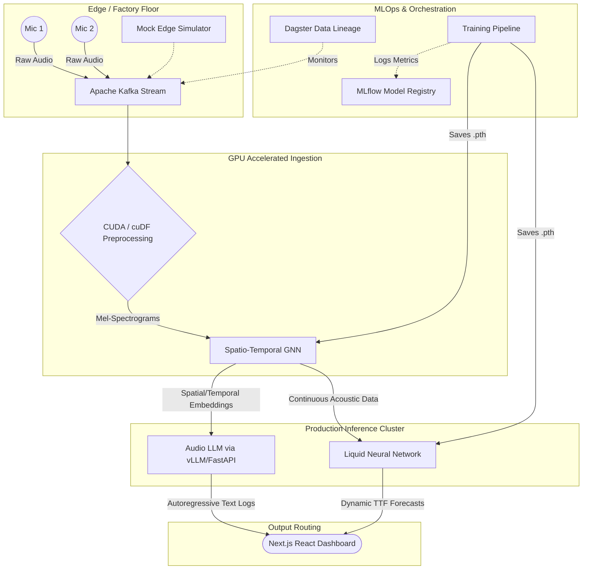

# Murmur
[](https://github.com/smparc/murmur/actions)
[]()
[]()
[]()
[]()


**Murmur** is an enterprise-grade, spatio-temporal acoustic monitoring system. It turns ambient mechanical noise into a predictive maintenance engine. By ingesting continuous, multi-channel audio feeds from a sparse grid of microphones, Murmur localizes anomalous sounds, translates them into human-readable telemetry using an Audio LLM, and dynamically forecasts cascading equipment failures using Liquid Neural Networks (LNNs). 


Designed to be shipped to production environments rather than existing as a local proof of concept, the system leverages high-performance GPU compute, containerized orchestration, continuous CI/CD, and a real-time React dashboard to handle massive audio streams in real time.


---


## System Architecture


The following diagram illustrates the continuous data flow from physical audio capture to predictive text telemetry.



```mermaid
graph TD
    subgraph Edge / Factory Floor
        M1((Mic 1)) --> |Raw Audio| K[Apache Kafka Stream]
        M2((Mic 2)) --> |Raw Audio| K
        Sim[Mock Edge Simulator] -.-> K
    end


    subgraph GPU Accelerated Ingestion
        K --> C{CUDA / cuDF Preprocessing}
        C --> |Mel-Spectrograms| ST[Spatio-Temporal GNN]
    end


    subgraph Production Inference Cluster
        ST --> |Spatial/Temporal Embeddings| LLM[Audio LLM via vLLM/FastAPI]
        ST --> |Continuous Acoustic Data| LNN[Liquid Neural Network]
    end


    subgraph MLOps & Orchestration
        Dagster[Dagster Data Lineage] -.-> |Monitors| K
        Train[Training Pipeline] --> |Saves .pth| ST
        Train --> |Saves .pth| LNN
        Train -.-> |Logs Metrics| MLflow[MLflow Model Registry]
    end


    subgraph Output Routing
        LLM --> |Autoregressive Text Logs| UI([Next.js React Dashboard])
        LNN --> |Dynamic TTF Forecasts| UI
    end
```


---


## Technology Stack


| Component | Technology | Purpose in Production |
| :--- | :--- | :--- |
| **Data Ingestion** | Apache Kafka | Handles continuous, high-throughput raw audio streams without packet loss. |
| **Serialization** | MessagePack | Binary-encoded tensor transport — 10-50x faster than JSON for spectrogram payloads. |
| **Preprocessing** | Custom CUDA / torchaudio | Bypasses CPU bottlenecks; extracts high-dimensional mel-spectrograms directly on the GPU. |
| **Feature Extraction** | ST-GNN (PyTorch Geometric) | Models the physical facility as a topological graph with temporal attention + spatial GCN layers. |
| **Telemetry Translation**| Multimodal Audio LLM | Acts as an autoregressive decoder, streaming text logs of physical anomalies (e.g., *"Impeller cavitation detected"*). |
| **Model Serving** | FastAPI + WebSocket | Exposes the LLM via REST and real-time WebSocket for the dashboard, with health probes for K8s. |
| **Source Localization** | GCC-PHAT TDOA | Recovers inter-microphone delays from phase; localizes the source and reweights the graph by measured acoustic coherence. |
| **Forecast Calibration** | Split Conformal Prediction | Distribution-free prediction intervals with finite-sample coverage, grouped by severity. |
| **Benchmarking** | MIMII / ToyADMOS | Evaluates the production detector on recorded machine faults; reports AUC and pAUC per machine type. |
| **Failure Prediction** | Liquid Neural Networks | Adapts to drifting degradation patterns continuously via ODEs to forecast Time-to-Failure (TTF). |
| **Anomaly Detection** | Convolutional Autoencoder + Adaptive Scorer | Unsupervised baseline learns "normal" acoustic patterns; online z-score thresholding per node. |
| **Configuration** | Centralized Settings | All settings driven by environment variables with typed defaults in `src/settings.py`. |
| **Observability** | Prometheus + MLflow | `/metrics` endpoint exports latency, throughput, anomaly counts, TTF predictions. |
| **Orchestration & Ops** | Dagster & MLflow | Tracks data lineage, pipeline health, and model drift over time. |
| **Deployment** | Docker & Kubernetes | Containerized microservices with health probes and HPA auto-scaling on acoustic energy spikes. |
| **CI/CD** | GitHub Actions | Automated linting, testing, Docker builds, and K8s deployment on push to main. |
| **Frontend** | React, Next.js, Recharts | Real-time WebSocket-connected dashboard with TTF forecasting chart and LLM diagnostic logs. |
| **Testing** | pytest | Unit tests for all models, anomaly detection, sliding window, training pipeline + integration tests. |


---


## Repository Structure


```text
murmur/
├── .github/
│   └── workflows/
│       └── ci.yml                       # CI/CD: lint, test, Docker build, K8s deploy
├── deploy/
│   ├── Dockerfile.ingest                # Container for CUDA audio preprocessing
│   ├── Dockerfile.inference             # Container for ST-GNN, LNN, and LLM serving
│   └── k8s/
│       ├── 01-kafka-cluster.yaml        # Kafka KRaft mode StatefulSet
│       ├── 02-ingest-deployment.yaml    # GPU-accelerated ingestion pods
│       ├── 03-inference-deployment.yaml # Load-balanced inference with health probes
│       └── 04-autoscaling-hpa.yaml      # Horizontal Pod Autoscaling rules
├── frontend/
│   ├── package.json                     # Next.js + TypeScript dependencies
│   └── app/
│       └── page.tsx                     # Live React dashboard (WebSocket-connected)
├── orchestration/
│   ├── __init__.py
│   └── data_pipeline.py                 # Dagster assets and drift monitoring schedules
├── src/
│   ├── __init__.py
│   ├── settings.py                      # Centralized env-var-driven configuration
│   ├── detection/
│   │   ├── __init__.py
│   │   └── anomaly_detector.py          # Autoencoder + online adaptive scorer
│   ├── evaluation/
│   │   ├── __init__.py
│   │   ├── metrics.py                   # AUC / partial-AUC, dependency-free
│   │   └── mimii.py                     # MIMII / ToyADMOS benchmark harness
│   ├── forecasting/
│   │   ├── __init__.py
│   │   ├── conformal.py                 # Split-conformal prediction intervals for TTF
│   │   └── liquid_network.py            # Continuous-time Closed-form Network (CfC)
│   ├── inference/
│   │   ├── __init__.py
│   │   └── worker.py                    # Kafka → ST-GNN → LNN → detector → telemetry API
│   ├── ingestion/
│   │   ├── __init__.py
│   │   ├── cuda_stream_processor.py     # Kafka → GPU spectrogram → sliding window → publish
│   │   ├── mock_edge_device.py          # Stochastic multi-fault factory simulator
│   │   ├── spatial_probe.py             # Time-aligned multi-channel TDOA aggregation
│   │   └── stft_kernels.cu              # Custom C++ CUDA kernels (Pre-emphasis & Hann)
│   ├── mapping/
│   │   ├── __init__.py
│   │   ├── st_gnn_model.py              # Spatio-Temporal GNN (Temporal Attention + Spatial GCN)
│   │   ├── tdoa.py                      # GCC-PHAT delays + hyperbolic source localization
│   │   └── topology_graph.py            # Physical room geometry configuration
│   ├── observability/
│   │   ├── __init__.py
│   │   └── metrics.py                   # Prometheus metrics (latency, anomalies, TTF)
│   ├── translation/
│   │   ├── __init__.py
│   │   └── llm_decoder.py               # FastAPI + WebSocket + Prometheus inference service
│   └── training/
│       ├── __init__.py
│       └── train_pipeline.py            # 4-stage training + conformal calibration
├── tests/
│   ├── conftest.py                      # Shared pytest fixtures
│   ├── test_anomaly_detection.py        # Autoencoder + scorer tests
│   ├── test_api.py                      # FastAPI endpoint tests
│   ├── test_api_enrichments.py          # Interval / localization survive the API boundary
│   ├── test_conformal.py                # Coverage guarantee + Mondrian calibration
│   ├── test_evaluation.py               # AUC/pAUC + MIMII harness end-to-end
│   ├── test_forecasting.py              # LNN unit tests
│   ├── test_ingestion.py                # Audio generation + MessagePack tests
│   ├── test_integration.py              # Kafka roundtrip integration test
│   ├── test_models.py                   # ST-GNN + topology unit tests
│   ├── test_settings.py                 # Configuration validation tests
│   ├── test_sliding_window.py           # Buffer + data quality tests
│   ├── test_spatial_probe.py            # TDOA aggregation + worker graph reweighting
│   ├── test_tdoa.py                     # GCC-PHAT + localization unit tests
│   ├── test_training_pipeline.py        # Data gen, splitting, metrics tests
│   └── test_worker.py                   # Streaming inference worker tests
├── docker-compose.kafka.yml             # Local Kafka broker for development
├── pyproject.toml                       # Package metadata, deps, ruff, pytest config
├── .dockerignore
├── .editorconfig
├── .gitignore
└── README.md
```


---


## Execution Pipeline


The project execution is divided into distinct phases to ensure scalability and fault tolerance.


| Phase | Description | Key Deliverables |
| :--- | :--- | :--- |
| **1. Ingestion** | Raw audio is captured and piped into Kafka topics. Custom CUDA kernels process the waveform into spectrograms on the fly. | Multi-channel streaming pipeline, CUDA preprocessing module. |
| **2. Mapping** | The facility's geometry is mapped into an ST-GNN. The model learns spatial dependencies (machine distances) and temporal acoustic patterns. | Trained ST-GNN, topological acoustic embeddings. |
| **3. Translation**| The ST-GNN embeddings trigger the Audio LLM inference engine. The LLM processes the embeddings to generate human-readable diagnostics. | vLLM serving endpoint, streaming text telemetry logs. |
| **4. Forecasting**| The Liquid Neural Network ingests the continuous streams. Its internal equations adapt in real time to shifting acoustic profiles. | Dynamic TTF (Time-to-Failure) probability metrics. |
| **5. Operations**| Dagster and MLflow monitor the data streams and track the drift of the LNN predictions over time. | Validated data lineage and retrain triggers. |
| **6. Deployment** | All microservices are containerized. Kubernetes handles horizontal pod autoscaling (HPA) during loud acoustic anomaly events. | Dockerfiles, K8s deployment manifests, CI/CD, active cluster. |


---


## ⚙️ Getting Started


### Prerequisites
*   NVIDIA GPU (CUDA 12.x compatible)
*   Windows Subsystem for Linux (WSL2) with Hardware Virtualization enabled (if on Windows)
*   Docker & Docker Compose
*   Kubernetes (Minikube/Kind for local, managed K8s for production)
*   Node.js v18+


### Installation & Local Simulation


**1. Clone the repository**
```bash
git clone [https://github.com/smparc/murmur.git](https://github.com/smparc/murmur.git)
cd murmur
```


**2. Spin up the Kafka Event Stream**
```bash
docker-compose -f docker-compose.kafka.yml up -d
```


**3. Train the Models (Initialize Weights)**
```bash
python3 src/training/train_pipeline.py
```


**4. Boot the Streaming Pipeline (Requires 3 Terminals)**
```bash
# Terminal 1: Start the CUDA Preprocessor
python3 src/ingestion/cuda_stream_processor.py


# Terminal 2: Start the LLM Telemetry Server
uvicorn src.translation.llm_decoder:app --host 0.0.0.0 --port 8000


# Terminal 3: Simulate the Edge Microphones
python3 src/ingestion/mock_edge_device.py
```


**5. Launch the Live Dashboard**
```bash
cd frontend
npm install
npm run dev
```
Navigate to `http://localhost:3000` to view the telemetry.


### Production Deployment


**1. Build the Preprocessing and Inference Containers**
```bash
docker build -t murmur-ingest:latest -f deploy/Dockerfile.ingest .
docker build -t murmur-inference:latest -f deploy/Dockerfile.inference .
```


**2. Deploy to Kubernetes**
```bash
kubectl apply -f deploy/k8s/
```


**3. Verify Pod Health**
Ensure all services (Kafka brokers, ST-GNN extractors, and LLM serving engines) are running:
```bash
kubectl get pods -o wide
kubectl get hpa murmur-inference-hpa
```


---


## Environment Configuration


All settings are driven by environment variables with sensible defaults. See [`src/settings.py`](src/settings.py) for the full list.


| Variable | Default | Description |
| :--- | :--- | :--- |
| `KAFKA_BROKER` | `localhost:9092` | Kafka broker connection string |
| `LLM_MODEL_NAME` | `Qwen/Qwen1.5-1.8B` | HuggingFace model ID for telemetry generation |
| `GNN_EMBEDDING_DIM` | `256` | ST-GNN output embedding dimension |
| `MLFLOW_TRACKING_URI` | `http://localhost:5000` | MLflow tracking server URL |
| `INFERENCE_PORT` | `8000` | FastAPI server port |
| `SAMPLE_RATE` | `16000` | Audio sample rate (Hz) |
| `MIC_COORDS` | 4-mic default | Microphone layout as JSON `[[x,y,z], ...]` in metres |
| `TDOA_ENABLED` | `true` | Enable GCC-PHAT source localization |
| `TDOA_INTERP` | `8` | Sub-sample interpolation factor for delay estimation |
| `TDOA_MIN_COHERENCE` | `0.15` | Minimum correlation for a pair to inform the position solve |
| `TDOA_STALENESS_TOLERANCE` | `0.5` | Max clock spread (s) still treated as one acoustic instant |
| `TDOA_EDGE_FLOOR` | `0.05` | Floor on coherence-based edge attenuation |
| `CONFORMAL_ALPHA` | `0.1` | Target miscoverage — `0.1` gives 90% prediction intervals |


---


## Testing


```bash
# Install dev dependencies
pip install -e ".[dev]"


# Run unit tests
pytest tests/ -v --ignore=tests/test_integration.py


# Run with coverage
pytest tests/ --cov=src --cov-report=term-missing --ignore=tests/test_integration.py


# Run integration tests (requires Kafka running)
docker-compose -f docker-compose.kafka.yml up -d
pytest tests/test_integration.py -v
```


---


## Architecture Details


### ST-GNN (Spatio-Temporal Graph Neural Network)


The ST-GNN models the factory floor as a topological graph:


1. **Temporal Attention** — Multi-head self-attention over each node's spectrogram sequence to capture frequency drift and transient impulses
2. **Spatial GCN** — Graph convolutional layers propagate acoustic correlations across physically connected microphone nodes (inverse-distance weighted edges)
3. **Graph Readout** — Global mean pooling + MLP projects the entire graph state into a dense embedding for downstream LLM/LNN consumption


### Acoustic Source Localization (GCC-PHAT / TDOA)

The graph the ST-GNN convolves over was originally *static* — edges weighted purely by how far apart the microphones are bolted. That encodes the building, but nothing about the sound currently in it: two microphones either side of a failing pump and two either side of a silent one carried identical weights.

`src/mapping/tdoa.py` recovers the missing signal from the multi-channel audio itself:

1. **GCC-PHAT** cross-correlates each microphone pair, dividing out the magnitude spectrum so only phase contributes. Plain cross-correlation is dominated by the 50/60 Hz mains rumble every channel shares, which peaks at zero lag no matter where the machine is. The phase transform is what makes the estimate survive a factory floor.
2. **Hyperbolic localization** (Chan-Ho linear least squares) intersects the per-pair delay hyperboloids to fix the source in space. On the reference 4-mic array this resolves a broadband source to within **~3 cm**.
3. **Dynamic edge weighting** multiplies the geometric weight by measured coherence, so the graph re-partitions itself around whatever is actually making noise. Decoupled pairs are *attenuated toward a floor, never severed* — a zero-weight graph collapses the GCN into a per-node MLP.

Because the mel transform discards phase, this has to run in the **ingestion** service on raw waveforms (`src/ingestion/spatial_probe.py`), and is published on `<PROCESSED_TOPIC>-spatial` for the worker to consume.

> **Clock synchronization is a hard requirement.** Inter-microphone delays span roughly 15 ms on a 5 m array. Edge devices whose clocks differ by more than that produce confident, meaningless positions. The probe reports `clock_spread` on every snapshot and exports it as `murmur_array_clock_spread_seconds` — **alert on it**. Production deployments need PTP, or NTP with a disciplined local clock.

**Known limitation:** the default array is coplanar, so elevation is unobservable in principle — a source above the plane and its mirror image below produce identical delays. The solver constrains to a horizontal plane by default and returns `None` rather than inventing a plausible `z`. A full 3-D fix needs a non-coplanar array of at least five microphones.

### Forecast Uncertainty (Conformal Prediction)

The Liquid Network emits a sigmoid. Nothing in the training objective makes that a calibrated probability — 0.73 does not mean "fails 73% of the time" — yet it is exactly the number a planner would schedule an outage against.

`src/forecasting/conformal.py` applies **split conformal prediction**, which converts the point estimate into an interval with a *finite-sample, distribution-free* coverage guarantee. No Gaussian assumption, no asymptotics, no retraining. Telemetry payloads gain a `ttf_interval` block:

```json
"ttf_interval": { "point": 0.32, "lower": 0.0, "upper": 0.80, "confidence": 0.9 }
```

Two details that carry the guarantee:

- **The calibration set is disjoint from both training *and* validation.** Training residuals are optimistically small; the validation set was used for early stopping and is no longer exchangeable. The pipeline halves the test split — one half calibrates, the other verifies realised coverage.
- **Calibration is Mondrian (per-severity), not marginal.** Marginal coverage is a weak promise: on heteroscedastic errors it hits 90% overall while systematically under-covering the *critical* bucket — the only machines anyone is monitoring for. Measured on a held-out heteroscedastic set, marginal calibration covers the critical stratum at 86% while over-covering healthy machines at 97.6%; grouping restores critical to 92% **and** tightens healthy intervals from 0.32 to 0.20.

If `models/conformal.json` is absent the worker logs a warning and ships bare point estimates — a documented degradation, not a silent one.

### Benchmarking on Real Machine Sound

Every accuracy number produced by the synthetic generator describes the generator. `src/evaluation/` runs the production detector over **MIMII** / **ToyADMOS** — recorded valves, pumps, fans and sliders with genuine mechanical faults mixed against real factory noise.

```bash
python -m src.evaluation.mimii /path/to/mimii --aggregate mean --json report.json
```

- The mel transform is **imported from the ingestion service**, not reimplemented, so the benchmark cannot silently drift from what production computes. Train/serve skew of exactly this kind is the most common reason offline metrics fail to survive deployment.
- Reports **pAUC** alongside AUC. A detector can post a respectable AUC while being useless below the false-alarm budget any plant would tolerate; here pAUC is mean recall over FPR ∈ [0, 0.1], so a detector blind in that regime scores ~0 rather than ~0.47.
- Breaks results down **per machine**. MIMII difficulty varies enormously by type — valves are near-impossible for reconstruction-based detectors because normal operation is itself impulsive — and a single pooled AUC hides that entirely.

The corpus is optional: the harness is exercised end-to-end in CI against a synthetic corpus in the same layout, so no 26 GB download is needed to run the tests.

### WebSocket Real-Time Feed


The dashboard connects to `ws://localhost:8000/ws/telemetry` via WebSocket. Every time the LLM generates a diagnostic, it's automatically broadcast to all connected clients with structured anomaly data (severity, TTF prediction, anomaly score) — not derived from text regex. The frontend includes auto-reconnect with exponential backoff. When disconnected, a clear "Backend offline" message is shown instead of fake data, which is critical for safety-critical monitoring systems.
