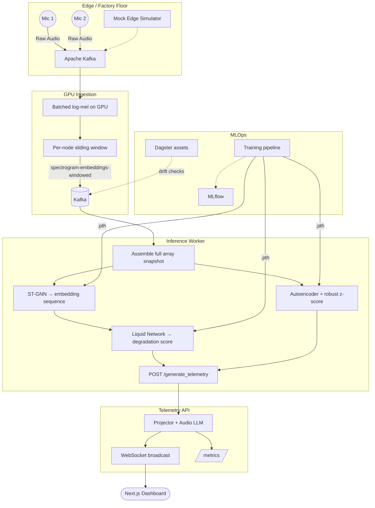

# Murmur

[](https://github.com/smparc/murmur/actions/workflows/ci.yml)
[]()
[](LICENSE)
[]()
[]()

**Murmur** is a spatio-temporal acoustic monitoring system. It turns ambient
mechanical noise into a predictive maintenance signal: continuous multi-channel
audio from a sparse microphone grid is localised across a graph of the facility,
scored for anomalies against each sensor's own baseline, given a per-machine
degradation score by a continuous-time network, and rendered as human-readable
telemetry on a live dashboard.

> **The degradation score is not a time-to-failure or a probability.** It is a
> regression onto fault severity in `[0, 1]` (0 = healthy, 1 = the most severe
> fault in training). Nothing in the label has a time axis, and nothing makes
> 0.7 mean "70% likely to fail". Earlier versions called it TTF and displayed it
> as a failure probability; both were wrong.

---

## System Architecture


```mermaid
graph TD
    subgraph Edge["Edge / Factory Floor"]
        M1((Mic 1)) -->|Raw Audio| K[Apache Kafka]
        M2((Mic 2)) -->|Raw Audio| K
        Sim[Mock Edge Simulator] -.-> K
    end

    subgraph Ingest["GPU Ingestion"]
        K --> C[Batched log-mel on GPU]
        C --> W[Per-node sliding window]
        W -->|spectrogram-embeddings-windowed| KT[(Kafka)]
    end

    subgraph Worker["Inference Worker"]
        KT --> A[Assemble full array snapshot]
        A --> ST[ST-GNN → embedding sequence]
        ST --> LNN[Liquid Network → degradation score]
        A --> AD[Autoencoder + robust z-score]
        LNN --> POST[POST /generate_telemetry]
        AD --> POST
    end

    subgraph Serve["Telemetry API"]
        POST --> LLM[Projector + Audio LLM]
        LLM --> WS[WebSocket broadcast]
        LLM --> PM[/metrics/]
    end

    WS --> UI([Next.js Dashboard])

    subgraph Ops["MLOps"]
        Dagster[Dagster assets] -.->|drift checks| KT
        Train[Training pipeline] -->|.pth| ST
        Train -->|.pth| LNN
        Train -->|.pth| AD
        Train -.-> MLflow[MLflow]
    end
```

The **inference worker** is the piece that makes this a system rather than a
collection of services: it consumes spectrogram windows, assembles a coherent
snapshot across the whole microphone array, runs the model chain, and submits
scored telemetry to the API.

---

## Technology Stack

| Component | Technology | Purpose in Production |
| :--- | :--- | :--- |
| **Data Ingestion** | Apache Kafka | High-throughput audio transport with at-least-once delivery and manual offset commits. |
| **Serialization** | MessagePack | Binary tensor transport, far cheaper than JSON for spectrogram payloads. |
| **Preprocessing** | torchaudio on CUDA | Batched log-mel spectrograms; chunks are fused into one GPU call rather than processed individually. |
| **Feature Extraction** | ST-GNN (PyTorch Geometric) | Temporal self-attention with positional encoding, then spatial GCN over a distance-weighted graph. |
| **Anomaly Detection** | Conv autoencoder + robust scorer | Unsupervised baseline; per-node median/MAD z-scoring adapts to sensor-specific noise floors. |
| **Source Localization** | GCC-PHAT TDOA | Recovers inter-microphone delays from phase; localizes the source and reweights the graph by measured coherence. |
| **Failure Prediction** | Liquid Neural Network (CfC) | Continuous-time forecasting over genuinely irregular inter-frame intervals. |
| **Forecast Calibration** | Split conformal prediction | Distribution-free intervals with finite-sample coverage, calibrated per severity stratum. |
| **Telemetry Translation** | Multimodal Audio LLM | Autoregressive diagnostics from a trained projection adapter; degrades to templated text when no LLM is resident. |
| **Model Serving** | FastAPI + WebSocket | REST, live WebSocket feed, API-key auth, rate limiting, split liveness/readiness probes. |
| **Configuration** | Validated settings | Environment-driven and validated at import, including the microphone layout. |
| **Observability** | Prometheus + MLflow | Latency, throughput, anomaly counts, degradation, consumer lag, end-to-end frame age, dead-lettered telemetry. |
| **Orchestration** | Dagster | Topology validation, detector health, drift evaluation against a baseline. |
| **Deployment** | Docker & Kubernetes | Non-root images, resource limits, PDB, GPU-aware API autoscaling; one worker per microphone array. |
| **CI/CD** | GitHub Actions | Lint, format, tests on 3 Python versions, Kafka integration, frontend build, manifest validation, image publish. |
| **Frontend** | React, Next.js, Recharts | Per-node forecast series, exponential-backoff reconnect, staleness indicators. |
| **Benchmarking** | MIMII / ToyADMOS / DCASE | Scores the production detector on recorded machine faults; AUC and pAUC per machine type, with pAUC on the DCASE scale for baseline comparison. |
| **Testing** | pytest | 515 tests across models, detection, localization, calibration, ingestion, worker, API, auth and configuration — all pass on a real Python 3.12 / CPU-only install. |

---

## Repository Structure

```text
murmur/
├── .github/workflows/ci.yml           # Lint, test, integration, frontend, images, manifests
├── deploy/
│   ├── Dockerfile.ingest              # CUDA ingestion image
│   ├── Dockerfile.inference           # API + worker image
│   └── k8s/                           # Namespace, Kafka, deployments, API HPA, PDB
├── frontend/                          # Next.js dashboard (App Router + Tailwind)
├── orchestration/data_pipeline.py     # Dagster assets and drift schedule
├── src/
│   ├── settings.py                    # Validated env-driven configuration
│   ├── detection/anomaly_detector.py  # Autoencoder + online robust scorer
│   ├── evaluation/                    # MIMII/ToyADMOS benchmark + AUC/pAUC
│   ├── forecasting/
│   │   ├── conformal.py               # Split-conformal prediction intervals
│   │   └── liquid_network.py          # Closed-form Continuous-time network
│   ├── inference/
│   │   ├── worker.py                  # Windows → models → telemetry
│   │   └── control.py                 # murmur-rebaseline operator command
│   ├── ingestion/
│   │   ├── cuda_stream_processor.py   # Kafka → batched GPU log-mel → windows
│   │   ├── mock_edge_device.py        # Multi-fault factory simulator
│   │   ├── spatial_probe.py           # Time-aligned multi-channel TDOA
│   │   └── stft_kernels.cu            # Reference CUDA kernels (not on the hot path)
│   ├── mapping/
│   │   ├── st_gnn_model.py            # Temporal attention + spatial GCN
│   │   ├── tdoa.py                    # GCC-PHAT delays + source localization
│   │   └── topology_graph.py          # Distance-weighted acoustic graph
│   ├── observability/metrics.py       # Prometheus metrics
│   ├── training/train_pipeline.py     # Four-stage training + conformal calibration
│   └── translation/llm_decoder.py     # FastAPI + WebSocket telemetry service
└── tests/                             # 515 unit + integration tests
```

---

## Getting Started

### Prerequisites

- Python 3.10–3.12
- Docker & Docker Compose
- Node.js 18+ (dashboard)
- NVIDIA GPU with CUDA 12.x — optional; everything runs on CPU

### Installation

```bash
git clone https://github.com/smparc/murmur.git
cd murmur

python -m venv .venv && source .venv/bin/activate   # Windows: .venv\Scripts\activate

# CPU wheels; omit for the default CUDA build
pip install --index-url https://download.pytorch.org/whl/cpu torch torchaudio
pip install -e ".[dev]"
```

### Running the pipeline

```bash
# 1. Broker
docker compose -f docker-compose.kafka.yml up -d

# 2. Train (writes models/*.pth)
murmur-train

# 3. Four processes
murmur-simulate    # edge microphones      → raw-audio-stream
murmur-ingest      # GPU preprocessing     → spectrogram-embeddings-windowed
murmur-worker      # models + scoring      → POST /generate_telemetry
uvicorn src.translation.llm_decoder:app --host 0.0.0.0 --port 8000

# 4. Dashboard
cd frontend && npm install && npm run dev
```

Then open <http://localhost:3000>.

To skip the multi-gigabyte model download during development, set
`LLM_ENABLED=false`. The service still emits full structured telemetry — anomaly
score, severity, degradation — with the narrative field templated. Responses carry a
`generated` flag so the dashboard can label templated text as such.

### Production deployment

```bash
docker build -t murmur-ingest:latest -f deploy/Dockerfile.ingest .
docker build -t murmur-inference:latest -f deploy/Dockerfile.inference .

# Set a real API key first — an empty key disables authentication
kubectl apply -f deploy/k8s/
kubectl get pods -n murmur -o wide
```

---

## Configuration

All settings are environment variables, validated at import. See
[`src/settings.py`](src/settings.py).

| Variable | Default | Description |
| :--- | :--- | :--- |
| `KAFKA_BROKER` | `localhost:9092` | Broker connection string |
| `MIC_COORDS` | 4-mic default | Microphone layout as JSON `[[x,y,z], ...]`, in metres |
| `DISTANCE_THRESHOLD` | `15.0` | Maximum acoustic coupling distance (m) |
| `SAMPLE_RATE` / `N_FFT` / `HOP_LENGTH` / `N_MELS` | `16000` / `1024` / `512` / `64` | STFT parameters |
| `SEQ_LENGTH` | `50` | Frames per temporal window |
| `GNN_EMBEDDING_DIM` | `256` | ST-GNN output dimension |
| `ANOMALY_Z_THRESHOLD` | `3.0` | Robust-z above which a frame is flagged |
| `LLM_MODEL_NAME` | `Qwen/Qwen1.5-1.8B` | HuggingFace model ID |
| `LLM_ENABLED` | `true` | Set `false` to serve templated telemetry |
| `MURMUR_API_KEY` | *(empty)* | Write key: `POST /generate_telemetry` and `/metrics`. Held by the worker and Prometheus. Enables auth when set |
| `MURMUR_DASHBOARD_KEY` | *(empty)* | Read-only key for the WebSocket feed. Build it into the dashboard as `NEXT_PUBLIC_DASHBOARD_KEY`; it is visible to anyone who can load the page, so it must differ from the write key |
| `ARRAY_ID` | `array-0` | Kafka key for array-wide messages. One worker per array |
| `ANOMALY_DRIFT_GUARD` | `true` | Flag a sustained departure from the post-warmup baseline, even when no single frame is anomalous |
| `ANOMALY_DRIFT_WINDOW` | `50` | Frames in the recent median the drift guard compares |
| `TELEMETRY_MAX_RETRIES` | `2` | Retries for a timed-out or 5xx submission before it is dead-lettered |
| `TELEMETRY_RETRY_BACKOFF` | `0.25` | Base of the exponential retry backoff (s) |
| `TELEMETRY_TIMEOUT` | `10.0` | Per-attempt HTTP timeout for telemetry submission (s) |
| `RATE_LIMIT_PER_MINUTE` | `1200` | Must exceed `NUM_NODES` per `CHUNK_DURATION` |
| `RATE_LIMIT_MAX_KEYS` | `10000` | Cap on retained rate-limit buckets, so the limiter cannot itself exhaust memory |
| `METRICS_REQUIRE_AUTH` | `true` | Gate `/metrics` behind the API key; set `false` for an in-cluster scraper |
| `ARRAY_MAX_WAIT` | `15.0` | Seconds to wait for absent microphones before emitting a degraded snapshot |
| `ARRAY_MIN_NODES` | `2` | Minimum microphones reporting before a snapshot is released at all |
| `WINDOW_STALENESS_TOLERANCE` | `5.0` | Spread (s) across one snapshot still treated as a single acoustic instant |
| `PUBLISH_FRAME_TOPIC` | `false` | Publish the per-frame topic; nothing in Murmur consumes it |
| `SLACK_WEBHOOK_URL` | *(empty)* | Slack incoming webhook for alerts |
| `PAGERDUTY_ROUTING_KEY` | *(empty)* | PagerDuty Events v2 routing key |
| `ALERT_WEBHOOK_URL` | *(empty)* | Generic JSON webhook for alerts |
| `ALERT_COOLDOWN_SECONDS` | `900` | Silence per node and fault after a page; escalation bypasses it |
| `ALERT_MIN_SEVERITY` | `warning` | Lowest severity that pages |
| `SIM_FAULT_MTBF_S` | `240.0` | Mean seconds between new fault onsets per node in `murmur-simulate`, as a Poisson process |
| `SIM_RECOVERY_PROBABILITY` | `0.02` | Chance per tick that a still-mild simulated fault begins to fade out |
| `TDOA_ENABLED` | `true` | Enable GCC-PHAT source localization |
| `TDOA_MIN_COHERENCE` | `0.15` | Minimum correlation for a pair to inform the position solve |
| `TDOA_STALENESS_TOLERANCE` | `0.5` | Max array clock spread (s) treated as one acoustic instant |
| `TDOA_EDGE_FLOOR` | `0.05` | Floor on coherence-based edge attenuation |
| `CONFORMAL_ALPHA` | `0.1` | Target miscoverage — `0.1` gives 90% prediction intervals |
| `MODEL_DIR` | `models` | Where weights and `conformal.json` are read and written |
| `SEED` | `1337` | Seeds every RNG for reproducible training |

Invalid combinations are rejected at startup with a message naming each problem,
rather than producing silently misshapen tensors downstream.

---

## Testing

```bash
pytest tests/ -m "not integration"                    # unit
pytest tests/ --cov=src --cov-report=term-missing     # with coverage
docker compose -f docker-compose.kafka.yml up -d
pytest tests/ -m integration                          # needs a broker
```

---

## Architecture Notes

### ST-GNN

1. **Input projection + sinusoidal positional encoding.** Self-attention is
   permutation-invariant; without positional information a model whose purpose
   is detecting temporal signatures would return an identical embedding for
   time-reversed input.
2. **Temporal attention**, applied per node so each microphone attends over its
   own history without leaking across the array.
3. **Spatial GCN** at every timestep, over `batch × seq` disjoint copies of the
   topology convolved in a single call.
4. **Readout** to either a pooled `(B, E)` embedding or a full `(B, S, E)`
   sequence.

The sequence output matters: a continuous-time forecaster fed one pooled vector
broadcast across time receives a constant, which defeats the reason to use one.

### Anomaly scoring

Reconstruction error is not comparable across microphones — a sensor above a
compressor sits at a completely different noise floor than one in a corridor.
Each node is therefore judged against a bounded rolling window of its own recent
history, using a median/MAD robust z-score. Median over mean is deliberate: a
developing fault contaminates the very statistics used to detect it, and the
mean is far more easily dragged along.

**A persistent fault must not become the new normal.** From one microphone's
score alone, a legitimate change of operating point and a fault that has
stopped getting worse look the same, so the scorer does not guess:

- Flagged frames are **not** admitted to the rolling baseline. When they were, a
  step fault displaced the median once it filled half the 500-frame window and
  read as normal from frame 251 on — about two minutes, after which it never
  alerted again.
- A **drift guard** compares the median of recent frames against an anchor frozen
  at the end of warmup, so a fault that creeps in below the per-frame threshold
  is caught even though the rolling baseline follows it.
- Accepting a change as the new normal is an explicit operator action:

  ```bash
  murmur-rebaseline --node 2 --reason "pump P-201 re-rated to 1450 rpm"
  ```

  The command goes to the worker over the control topic and is logged with who
  asked and why. It needs broker access, not the dashboard key.

### Telemetry delivery

The telemetry API is the live feed; alerts are raised by the worker directly and
do not depend on it. A submission that times out or gets a 5xx is retried with
backoff (`TELEMETRY_MAX_RETRIES`); a 429 or other 4xx is not, since retrying
cannot help. Anything still undelivered is written, with the reason, to
`<PROCESSED_TOPIC>-telemetry-dlq`, and offsets advance only once that write is
acknowledged — if it is not, the worker rewinds and re-consumes the batch. So a
scored result is never silently lost, but it is also never replayed into the
live feed later, where it would be shown as current. After one payload exhausts
its retries during an outage, the rest of that snapshot skips them, so an outage
cannot stall the consumer.

### Scaling

The worker needs every microphone of an array to assemble a snapshot, so windows
(and TDOA snapshots) are keyed by `ARRAY_ID` and one array is consumed by
exactly one worker. There is no worker autoscaler: a second replica for the same
array receives no partitions. More arrays means more worker Deployments, each
with its own `ARRAY_ID` and `MIC_COORDS`. Ingestion stays at one replica per
array while TDOA is enabled, because localisation needs every microphone's raw
audio in one process.

### Liquid Network

`ncps`' `CfC.forward` reduces each step's timespan with
`timespans[:, t].squeeze()`, yielding a `(batch,)` vector multiplied against a
`(batch, units)` activation — which only broadcasts when `units == batch`.
Supplying real per-sample timings therefore raises for any batch above one.
`src/forecasting/liquid_network.py` drives the underlying cell directly with a
`(batch, 1)` timespan so every sample integrates over its own interval.

### WebSocket feed

### Acoustic Source Localization (GCC-PHAT / TDOA)

The graph the ST-GNN convolves over was originally *static* — edges weighted purely by how far apart the microphones are bolted. That encodes the building, but nothing about the sound currently in it: two microphones either side of a failing pump and two either side of a silent one carried identical weights.

`src/mapping/tdoa.py` recovers the missing signal from the multi-channel audio itself:

1. **GCC-PHAT** cross-correlates each microphone pair, dividing out the magnitude spectrum so only phase contributes. Plain cross-correlation is dominated by the 50/60 Hz mains rumble every channel shares, which peaks at zero lag no matter where the machine is. The phase transform is what makes the estimate survive a factory floor.
2. **Hyperbolic localization** (Chan-Ho linear least squares) intersects the per-pair delay hyperboloids to fix the source in space. On the reference 4-mic array, a noiseless broadband source resolves to a **median of ~7 cm** across the floor — a few centimetres at the positions the test suite pins, degrading sharply near the array centroid, where the hyperbolas become nearly parallel and the solve is ill-conditioned.

   **The residual cannot detect that, so every fix now carries a GDOP.** With four microphones and three unknowns the system is exactly determined, so it fits perfectly whatever the geometry — measured across the floor, a source at the circumcentre produces a residual of `2.3e-14` against `3.4e-14` for a well-conditioned fix out near the microphones. The residual is not merely uninformative there; it points the wrong way. Geometric dilution of precision measures the conditioning the residual is blind to:

   | source | error | residual | GDOP | verdict |
   |---|---:|---:|---:|---|
   | (3.5, 7.0) | 0.032 m | 3.4e-14 | 1.12 | reliable |
   | (1.0, 1.0) | 0.000 m | 9.2e-15 | 0.76 | reliable |
   | centroid | 0.000 m | 2.3e-14 | ∞ | **unreliable** |
   | centroid + 5 cm | 0.072 m | 2.5e-03 | 6.5e6 | **unreliable** |

   Reproduce with `python -m src.mapping.tdoa`. `SourceFix.reliable` gates on `GDOP <= 10` — the conventional GNSS cutoff, which lands in the right place here — and the worker **omits** `source_position` from the telemetry payload when the fix is unreliable rather than shipping it. That field becomes the alert's `location`: the coordinates an engineer walks to. A confidently wrong one sends them to the wrong machine, which is worse than sending them nothing.
3. **Dynamic edge weighting** multiplies the geometric weight by measured coherence, so the graph re-partitions itself around whatever is actually making noise. Decoupled pairs are *attenuated toward a floor, never severed* — a zero-weight graph collapses the GCN into a per-node MLP.

Because the mel transform discards phase, this has to run in the **ingestion** service on raw waveforms (`src/ingestion/spatial_probe.py`), and is published on `<PROCESSED_TOPIC>-spatial` for the worker to consume.

> **Clock synchronization is a hard requirement.** Inter-microphone delays span roughly 15 ms on a 5 m array. Edge devices whose clocks differ by more than that produce confident, meaningless positions. The probe reports `clock_spread` on every snapshot and exports it as `murmur_array_clock_spread_seconds` — **alert on it**. Production deployments need PTP, or NTP with a disciplined local clock.

**Known limitation:** the default array is coplanar, so elevation is unobservable in principle — a source above the plane and its mirror image below produce identical delays. The solver constrains to a horizontal plane by default and returns `None` rather than inventing a plausible `z`. A full 3-D fix needs a non-coplanar array of at least five microphones.

### Degradation Uncertainty (Conformal Prediction)

The Liquid Network emits a sigmoid regressed onto severity. Nothing in the training objective makes that a probability — 0.73 does not mean "fails 73% of the time" — yet a bare point estimate is exactly the kind of number a planner would schedule an outage against.

`src/forecasting/conformal.py` applies **split conformal prediction**, which converts the point estimate into an interval with a *finite-sample, distribution-free* coverage guarantee. No Gaussian assumption, no asymptotics, no retraining. Telemetry payloads gain a `degradation_interval` block:

```json
"degradation_interval": { "point": 0.32, "lower": 0.0, "upper": 0.80, "confidence": 0.9 }
```

Three details that carry the guarantee:

- **Calibration uses the served quantity.** The worker ships one score per microphone from that microphone's embedding trajectory. Training and calibration run the same `per_node_forecast` path, with per-microphone labels. They previously used the pooled graph readout, so the LNN and the interval radii were fitted to a quantity that was never served.

- **The calibration set is disjoint from both training *and* validation.** Training residuals are optimistically small; the validation set was used for early stopping and is no longer exchangeable. The pipeline halves the test split — one half calibrates, the other verifies realised coverage.
- **Calibration is Mondrian (per-severity), not marginal.** Marginal coverage is a weak promise: on heteroscedastic errors it hits 90% overall while systematically under-covering the *critical* bucket — the only machines anyone is monitoring for. Measured on a held-out heteroscedastic set, marginal calibration covers the critical stratum at 86% while over-covering healthy machines at 97.6%; grouping restores critical to 92% **and** tightens healthy intervals from 0.32 to 0.20.

If `models/conformal.json` is absent the worker logs a warning and ships bare point estimates — a documented degradation, not a silent one.

### Benchmarking on Real Machine Sound

Every accuracy number produced by the synthetic generator describes the generator. `src/evaluation/` runs the production detector over **MIMII** / **ToyADMOS** — recorded valves, pumps, fans and sliders with genuine mechanical faults mixed against real factory noise.

```bash
python -m src.evaluation.mimii /path/to/mimii --aggregate mean --json report.json
```

- The mel transform is **imported from the ingestion service**, not reimplemented, so the benchmark cannot silently drift from what production computes. Train/serve skew of exactly this kind is the most common reason offline metrics fail to survive deployment.
- Reports **pAUC** alongside AUC. A detector can post a respectable AUC while being useless below the false-alarm budget any plant would tolerate. Two scales are reported, and they are not interchangeable: `pauc` is mean recall over FPR ∈ [0, 0.1] (chance 0.05, and a detector blind in that regime scores ~0), while `pauc_standardized` is the McClish standardisation that scikit-learn, the official DCASE evaluator and every published DCASE baseline use (chance 0.5, blind ≈ 0.47). **Compare against a published baseline on the standardised scale only** — on DCASE 2020 pump the same detector reads 0.41 on one and 0.69 on the other.
- Breaks results down **per machine**. MIMII difficulty varies enormously by type — valves are near-impossible for reconstruction-based detectors because normal operation is itself impulsive — and a single pooled AUC hides that entirely.

The corpus is optional: the harness is exercised end-to-end in CI against a synthetic corpus in the same layout, so no 26 GB download is needed to run the tests.

`benchmarks/evaluate_dataset.py` (the DCASE/MIMII/IMS harness behind `paper/results/`) did not follow this rule until recently: its feature extractor reimplemented the mel transform with `log1p` compression instead of importing the production one, on the mistaken belief that the production module opens a Kafka connection at import time. It does not — `src/evaluation/mimii.py` already imports it directly — so `benchmarks/features.py` now does the same. `log1p` and production's `AmplitudeToDB(top_db=80)` compress dynamic range differently enough to change an autoencoder's reconstruction-error scale and its sensitivity to quiet detail, and it made a real difference: rerun against the DCASE2020 pump set (4 units, 20 epochs, seed 1337, official split) the corrected pipeline scores **mean AUC 0.6730 / mean pAUC@10% 0.2632**, down from the previously-reported 0.7064 / 0.4061 — because the earlier number was measuring a feature representation production does not compute, not the deployed system. `paper/results/dcase2020_pump.json` and `paper/murmur.tex` are updated to this measured result.

### Simulator Realism

`src/ingestion/mock_edge_device.py` (`murmur-simulate`) drives the live dashboard demo, and is deliberately kept separate from anything a benchmark number depends on — but it used to be a poor stand-in for a factory even as a demo. Two things were wrong:

- **Fault arrival was a flat 3%-per-tick coin flip.** At a 0.5 s chunk cadence that starts a new degradation episode on some node roughly every 17 seconds, with a 10% chance per tick to snap a mild fault straight back to healthy — a dashboard that never stops flashing alarms and looks nothing like a plant, where a bearing going bad is a weeks-to-months event. Fault onset is now a Poisson process with a configurable mean time between failures (`SIM_FAULT_MTBF_S`, default 240s per node), and recovery — `SIM_RECOVERY_PROBABILITY` — fades a mild fault out over several ticks instead of resetting it instantly.
- **The signatures themselves were arbitrary tones over white noise.** Bearing squeal is now an amplitude-modulated impact/ring-down train at a ball-pass-frequency-outer, tied to a nominal shaft speed, rather than a continuous sine; rotor imbalance modulates at 1x running speed instead of an unrelated constant; cavitation shapes broadband noise toward the mid/high band instead of flat white noise; and the ambient floor is 1/f (pink) noise plus mains hum and its odd harmonics instead of a single 60 Hz tone over Gaussian noise.

None of this touches detection accuracy — `benchmarks/scenario.py` still drives `generate_mock_audio` on a fixed, labelled schedule for the synthetic regression gate, and nothing about real-data benchmarking depends on the live simulator. It only affects what the live demo sounds and looks like.

### Findings From Actually Running the Pipeline

Two more defects surfaced once the dependencies were actually installed and the pipeline actually executed on a real machine, rather than read:

- **The production autoencoder was pretrained on the wrong distribution.** `src/training/train_pipeline.py`'s `generate_normal_spectrograms` — stage 1 of `murmur-train` — built "healthy" spectrograms by hand-drawing Gaussian blobs directly in spectrogram space, in a range (mean ≈ 0.2, roughly `[-0.2, 1.2]`) that shares almost no overlap with what the production mel transform actually outputs for real simulator audio (mean ≈ 13, roughly `[3, 43]` in dB — verified by running both through the same transform and comparing). The gap predates this session's dB-scaling fix above: it was already ~16x under the old `log1p` scale too. A model trained on one distribution and scored on a disjoint one can't learn anything about the boundary between healthy and faulty; measured end-to-end, a "trained" autoencoder scored within noise of the untrained frame-energy fallback (ROC AUC 0.8456 vs 0.8463 on the synthetic regression benchmark) — training was buying nothing. Fixed by building the pretraining set from `mock_edge_device.generate_mock_audio` through the real production transform, the same fix applied to `benchmarks/features.py` above.

  This did not make the synthetic benchmark number go up. A properly-trained autoencoder, now actually modelling the real healthy manifold, scores **ROC AUC ≈ 0.71** on `benchmarks.evaluate_synthetic` — worse than the untrained fallback's 0.85, and unmoved by training for longer or on more samples (tried both). The likely reason: the old mismatched model behaved *by accident* like an energy detector, since everything it saw at eval time was equally out-of-distribution to it and reconstruction error tracked input magnitude — which happens to correlate with the fault energy this simulator injects. A model that has genuinely learned the healthy manifold reconstructs some of that fault energy too, since it now has real spectral structure to fall back on. That is a harder, more honest number, not a regression, and it says the current autoencoder architecture/training budget (15 epochs, 800 samples, a 32-dim latent space) has real room to improve against a target that no longer flatters it by mistake.

- **The benchmark harness crashed on Windows.** `benchmarks/evaluate_dataset.py` printed its results table containing a "Δ" character directly to the console. Windows' default console encoding is the legacy ANSI code page, not UTF-8, so `print()` raised `UnicodeEncodeError` after several CPU-minutes of real training — and the run's `--json` output was never written, because the crash landed before the file write. Confirmed by actually hitting it during this session's DCASE rerun. Fixed by reconfiguring stdout/stderr to UTF-8 at the top of `main()`, and by writing the JSON before printing the console table so a display problem can never cost a finished benchmark run again.

### WebSocket Real-Time Feed

The dashboard connects to `ws://localhost:8000/ws/telemetry` and receives
structured frames — severity, anomaly score, robust z, degradation — alongside the
prose. It never pattern-matches generated text, because model output is not a
stable interface. New clients receive a short replay buffer so an operator
opening the page mid-shift sees context rather than a blank screen; that buffer
is cleared on restart so pre-restart frames are never presented as current.

---

## License

[MIT](LICENSE)
